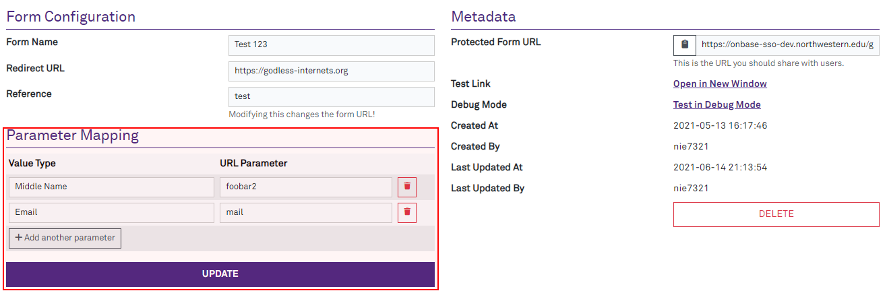

# Livewiring with a Light Touch

Nick Evans


---

# Objective
<!-- I have a couple goals here on what I want to show you. 

The first is a little bit of webdev history, which should put Livewire into its proper context. You might wonder why I'm talking about some of that stuff, but it'll make sense at the end.

Then, we move on to Livewire! I'll show some code and we'll talk about the pros and cons.
-->

- A little webdev history
- Showcase some different ways to use Livewire
    - ... and then my favorite way to use Livewire

---

# Basic Forms
<!-- 
Ok, so, scenario. You're building a form to map fields together.

Here's our starting point: a form that submits a POST when you click the save button. Inside the form is a fieldset for two text boxes, for the origin & destination field names in your mapping.

This form is static and lets you enter exactly one mapping, which is fantastic right up until you need two.
-->

```html
<form method="POST" action="/some-url">
    <fieldset id="mapping-1">
        <legend>Field #1</legend>

        <label for="origin-1">Origin Field</label>
        <input type="text" name="origin-1" id="mapping-1">

        <label for="dest-1">Destination Field</label>
        <input type="text" name="dest-1" id="dest-1">
    </fieldset>

    <button type="button" id="add">Add Another Field</button>
    <button type="submit">Save</button>
</form>
```

---
<!--
The HTML we just looked at is much simpler, but this is what it would look like with some styling applied.

It's for setting up a variable number of mappings. This particular screenshot is the OnBase SSO Shim, where an admin maps fields from the directory to URL parameters in the URL users are redirected to, so the form can get directory data.

The markup didn't have the delete or "add another parameter" button. We'll get to that second one at some point!
-->


---

# Olde Schoole Way: jQuery
<!-- 
So our first challenge is to make that "Add Another Field" button work, right?

In the primordial times, we would have used techniques called "DHTML", or Dynamic HTML. This wasn't a real spec or library or anything -- it was just when IE4's DOM API for JS was good enough to manipulate HTML in real-time.

But a little bit later, we came up with jQuery, and that stuck around for a long time. So to make that button work, you might do something like this: bind the click handler and them vomit some strings of HTML into the form tag's children.

And yes, I know there's a bug here. I need the examples to fit on a slide so I don't want to get too complicated. For similar reasons of brevity, I'm using some modern JS syntax too.
--->

```js
// <button type="button" id="add">Add Another Field</button>

$(document).ready(() => {
    $('add').click(() => {
        const numFieldSet = $('form fieldset').length;
        $('form').append(`<fieldset>
            <legend>Field #${numFieldSet + 1}</legend> 
            . . . more tags . . .
        `);
    });
});
```

---

# Problems
<!--
That was the way to go from like, 2004 through to 2021. It will still serve perfectly well today, and if you're working in an environment that relies in jQuery, it's not bad or wrong or anything like that.

There are downsides though, particularly with a traditional MVC-style web app where your backend's view layer is rendering pages, because now you're splitting that responsibility up. For our one silly example, it's not a huge deal, but then you have things like FRS. Finding where to change something there can be a bit of a bear because it's JS split up across a ton of views.

The append() call also has a big string of JS. I don't think anyone made nice IDE plugins for jQuery, so you'll frequently lose all of their features if you just start typing HTML in a JS string. Which isn't the end of the world, but it does mean you'll make more errors. And code without syntax highlighting is less pleasant than code with it...
-->
- Spreading your logic
    - Backend views 
    - Front-end's DOM manipulations
- HTML in a big JS string typically costs you:
    - Syntax highlighting
    - Linting/analysis
    - Typehinting (my IDE even typehints CSS classes!)

---

# Livewiring the Form
<!-- 
That first downside, splitting things up into an unknown number of jQuery callbacks, can be mitigated with something like Livewire, Vue, or React. These centralize control, so instead of a random spot binding click handlers by ID, they're a lot more deliberate about what's going on.

I prefer Livewire for our Laravel apps, since it keeps things mostly in Blade and PHP, with minimal JS needed. 

And that was our history lesson, BTWs. Let's look at how to Livewire our form.

This is a Blade view now, so we can do loops. I'll show the PHP side of this next, but imagine we've got an array of mappings tracked, and we bind the "Add Another Field" to the "click" method.
-->
```html
<form method="POST" action="/some-url">
    @foreach ($mappings as $i => $mappings)
    <fieldset id="mapping-{{ $i }}">
        <legend>Field #{{ $i }}</legend>

        <label for="origin-{{ $i }}">Origin Field</label>
        <input type="text" name="..." id="..." wire:model="mappings.{{ $i }}.origin">

        <label for="dest-{{ $loop->index }}">Destination Field</label>
        <input type="text" name="..." id="..." wire:model="mappings.{{ $i }}.dest">
    </fieldset>
    @endforeach

    <button type="button" wire:click="add">Add Another Field</button>
    <button type="submit">Save</button>
</form>
```

---
<!-- 
Here's how I'd implement the backend parts. This is pretty straightforward: ensure there's always at least one mapping, so the form has at least one origin/destination text field, and when somebody wants to add one, just add a new entry the the array.

This mirrors what the jQuery code was doing. The form itself is still just an HTML form -- clicking the button adds more fields, but Livewire is just enhancing the existing HTML with a bit of dynamicism.

The Save button is untouched here. That will still submit a normal form POST to the next page.
-->

```php
class MappingForm extends Component
{
    public array $mappings = [];

    public function render(): View
    {
        if (count($this->mappings) === 0) {
            $this->add(origin: '', dest: '');
        }

        // Our HTML from before!
        return view('mapping-form');
    }

    public function add(string $origin, string $dest): void
    {
        $this->mappings[] = [
            'origin' => $origin,
            'dest' => $dest,
        ];
    }
}
```

---

<!--
So you might be thinking "wow boring you just gave me the most basic livewire demo, i've seen this before nick". And you are correct!

But I'm building to a point. A lot of times, when people reach for Livewire, they end up yielding all control of the form to it. 

In this example, which I will call the Heavy Touch", instead of adding more text fields to the form, this is actually saving them to the database as you add them. This changes the dynamic a bit: instead of Livewire adding some dynamic HTML features to the page, it's now in charge of the whole page. It has to validate the form data, save it, and give the user feedback about all of this.
-->

```php
class MappingForm extends Component
{
    public ParentModel $model;
    protected $rules = [
        'mappings.*' => 'required|array',
        'mappings.origin' => 'required|string',
        'mappings.dest' => 'required|string',
    ];

    // render() & add() omitted for brevity, but they're still here!

    public function save(): Redirect
    {
        $this->validate();
        $this->model->mappings()->each->save();
        request()->session()->flash('status', 'Mappings saved, woo!');
        return redirect('/homepage');
    }
}
```
---

## Analysis of "Heavy Touch"
<!--
You might think there's not much of a difference in our example. Who cares if a controller is validating and saving vs that Livewire component? It's just a small form.

But going back to the real-world example I was drawing from: here is an image of the whole form. Our Livewired piece is highlighted in red, but as you can see, there are several other fields and pieces of functionality in the <form> tag.

The downside with our Heavy Touch approach is that the Livewire component now needs to take over *all* of this. Validations beyond its scope, rendering other fields, handling whether the form record has been created in the DB yet or not, the copy functionality, the delete functionality on the right side.

These are WAY more problems than it needs to be concerned with. You just wanted what what our original jQuery snippet did. That was about ten lines of code.
-->
- **Consider**: this isn't the only part of the form.



---
<!--
When I Livewire something, my typical approach is to build it as a normal set of controller actions and a regular-old Blade view. 

Once all of this is working, I'll go back and extract small bits into Livewire components.

As long as my Livewire components are only manipulating the HTML for the form, then when the user hits 'Submit', their browser is still submitting the form data in the expected format. Everything I wrote before will still work -- validating, saving, etc doesn't have to be touched.

That is why I call it the 'light touch' approach.
--->
# Nick's (typical) Approach
1. Build page
2. Add Livewire spice to the already-working page
3. ???
4. Profit!

---
<!-- 
As you saw in the header for the last slide, the light touch approach is my TYPICAL approach.

Default would be another good word for it. There are cases where there's going to be SO MUCH going on, that it's easier to yield full control to Livewire. 

This is whenever you've got a TON of dynamic features in a page that all need to interact with each other. For example...the main data table for an app like FRS, NLA, SOAP, or GSP. Dozens of filters, sorting, popups, bulk action checkboxes, events being broadcast every which way.

The way I think of it: that's when we're using Livewire more like Vue or React to build a rich UI, than using it like jQuery to add a little bit of spice in some specific spots.
-->
# Counterpoint
- Everything is situational
- Some times, you DO want Livewire to take total control of a page
- Gotta think it through :thinking:

---
<!-- 
Okay, that's it. Thanks for listening to me. I hope this was interesting!

I'll post the deck in our SharePoint folder, but if you'd like a copy of the deck or notes right now, you can scan that QR code for the repo URL. It's all markdown.

Questions?
-->

# Thank you!
Questions?

Scan the QR code for the deck source code!


